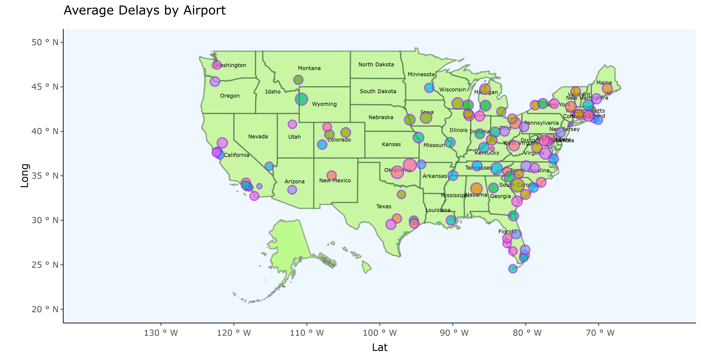

```{r setup, include=FALSE}
knitr::opts_chunk$set(echo = TRUE)
```
## Introduction 
This report will look at the `nycflights13` dataset in R, this package contains data on flights into and out of the three main airports, Newark, JFK and La Guardia, serving New York for every day in 2013. The aim is to explore the data to see what picture emerges.

As the data is mostly a collection of recorded values (~330,000 across the 5 tables) from a variety of sources there is, as expected, a huge amount of missing data points to deal with. It seemed wasteful to fully omit these observations, so missing data is dealt with on a case-by-case as the analysis is being done.

In generating visualisations we have joined data from the airlines, airports, planes and weather data frames to seek insights. First we explore airlines to look at their punctuality. This leads us on to explore delays and what factors have influence, we map airports with punctuality data, before looking at weather and finally turning to the planes themselves to see if plane size has an influence.
```{r echo=FALSE, warning=FALSE,message=FALSE}
#install.packages("remotes")
#remotes::install_gitlab("hrbrmstr/albersusa")
#install.packages("alberusa")
#tinytex::reinstall_tinytex()
library(nycflights13)
library(dplyr)
library(ggplot2)
library(plotly)
library(RColorBrewer)
library(tidyverse)
library(sf)
library(hrbrthemes)
library(viridis)
library(albersusa)
library("maps")
library("tools")
library(corrplot)
library(kableExtra)

weather <- nycflights13::weather


```
## Methods
The main analysis in this project will assess both departure delays out of NYC and subsequent arrival delays in destination airports. Exploratory data analysis on `nycflights13` package was done subsetting out some fundamental variables in order to further investigate.

This project makes use of the dplyr package for data manipulation, ggplot2 for data visualisation along with some additional color scheme packages to optimise plots. Some spatial visualisation is done using the simple features package as well as using geographic coordinates provided in the data. This was used in a plotly graph to implement some interactive analysis.

Further statistical techniques provide some detailed explanations towards justifications for delays/on-time flights including: correlation plots and comparative loess curves as well as general observations alongside visual analysis.

## Airline delays and Analysis
The first plot (below, left) shows the average total delay (Arrival delay + Departure Delay) of each airline. Alaska Airlines appears to be the most punctual, more analysis needs to be done here to assess the time delays as there are more flights recorded for certain airlines and apparent outliers which may skew the average.

The plot on the right shows where the total delay is more than an hour. Alaska Airlines still comes out in the top three with 56 flights that had over an hour delay, compared to ExpressJet Airlines with 11503 flights with over an hour delay.
```{r echo=FALSE, message=FALSE, warning=FALSE, figures-side, fig.show="hold", out.width="50%"}

#This is to get the total delay which will be used to see what airline has the most and least delays:
flights<- mutate(flights, totaldelay = arr_delay + dep_delay)

# Adding names of the carrier and changing the column name for clarity:
flights<- flights %>% left_join(airlines, by = c('carrier' = 'carrier'))
colnames(flights)[21]<- "CarrierName"

delays<-flights %>% group_by(CarrierName) %>% 
  summarise(Average_Delay = mean(totaldelay, na.rm =
TRUE)) %>% 
  ggplot(aes(reorder(CarrierName,Average_Delay), Average_Delay, fill= CarrierName)) + geom_bar(stat ='identity', color = rainbow(16)) + scale_x_discrete(guide = guide_axis(angle = 90)) 

delays<-delays + theme_classic()+ ggtitle('Average Delay by Airline')+
  xlab("Airline") + ylab("Average Delay")
delays


hourdelay<-flights %>% filter(totaldelay > 60) %>% count(CarrierName, sort =TRUE) %>% 
  mutate(CarrierName = factor(CarrierName, levels = CarrierName, ordered =TRUE)) %>%
ggplot(aes(CarrierName, n, fill = CarrierName)) + geom_bar(stat ='identity', color = rainbow(16)) + scale_x_discrete(guide = guide_axis(angle = 90)) 

hourdelay<-hourdelay + theme_classic()+ ggtitle('Delays of more than 60 Minutes')+
  xlab("Airline") + ylab("Count")
hourdelay

```

The plot below shows the overall picture for punctuality across all airlines in the three airports serving NY.
```{r echo=FALSE, message=FALSE, warning=FALSE, fig.width=6, fig.height=2,fig.align='center', out.width="50%"}
flightsx <- left_join(flights,weather) %>%
  dplyr::select(day, month,dep_delay, arr_delay, carrier,origin, dest, air_time, distance ,time_hour, temp:visib) %>%
  subset(select= -(wind_gust)) #rm wind_gust cause missing too many values
# add time_status and duration columns
flightsx$time_status <- NA
flightsx1 <- flightsx %>% filter(dep_delay > 15) %>% mutate(time_status="delayed")
flightsx2 <- flightsx %>% filter(dep_delay <= 15) %>% mutate(time_status="on_time")
flightsx3<-rbind(flightsx1,flightsx2)
flightsx3 <- flightsx3 %>% arrange(day,month,time_hour)
flightsx3$duration <- NA
flightsx12 <- flightsx3 %>% filter(air_time < 180) %>% mutate(duration="short haul")
flightsx22 <- flightsx3 %>% filter(air_time >= 180 & air_time < 360) %>% mutate(duration="medium haul")
flightsx32 <- flightsx3 %>% filter(air_time >= 360) %>% mutate(duration="long haul")
flightsx4<-rbind(flightsx12,flightsx22,flightsx32)

ggplot(data = flightsx4, aes(x = carrier , fill = time_status)) + labs(title = 'Count of delayed/on-time flights by carrier') + geom_bar(position = position_dodge(preserve = "single")) + theme_classic()+ ggtitle('Delay and On time counts for each airline') + xlab("Airline") + ylab("Count")


```
## Mapping Airport Delays

To further explore this data, a map was created by joining the latitude and longitude information from the airports dataset. The map shows airports that have the most delays on arrival, a larger dot represents a bigger delay. To view the interactive plotly version please follow this link: https://rpubs.com/suedge12/757742

```{r pressure, echo=FALSE, fig.align='center', fig.cap="Flight Delays in US airports", out.width = '100%'}

```


```{r echo=FALSE,warning=FALSE,message=FALSE,fig.width= 2, fig.height = 2, fig.align='left', fig.show='hold'}
library(albersusa)
m<-usa_sf()
library("maps")
states <- st_as_sf(map("state", plot = FALSE, fill = TRUE))
states <- cbind(states, st_coordinates(st_centroid(states)))
library("tools")
states$ID <- toTitleCase(states$ID)


flights1 <- flights %>% group_by(dest) %>% 
  summarise(avg_delay = mean(totaldelay, na.rm = T)) %>% 
  left_join(airports, c("dest"="faa")) %>%
  arrange(desc(avg_delay))


map1<-ggplot(data = m) +
    geom_sf(fill = "chartreuse1",alpha = 0.45) +
    geom_sf(data = states, alpha = 0.25, color = "darkgreen", size = 0.3) + 
    geom_text(data = states, aes(X, Y, label = ID),check_overlap = TRUE,fontface = "bold", size = 2) +
  geom_point(data = flights1, aes(x = lon, y = lat, size = avg_delay, fill = name), color = "purple", alpha = 0.7)+ guides(fill = FALSE) + scale_size(range = c(0, 5), name="Average Delay in Minutes") +
  coord_sf(
    xlim = c(-130, -70),
    ylim = c(20, 50)
  )


map1<-map1 + theme(
  panel.border = element_blank(),
  panel.grid.major = element_blank(),
  panel.grid.minor = element_blank(),
  panel.background = element_rect(colour= "aliceblue", fill = "aliceblue",
                                size = 0.5, linetype = "solid"),
  axis.line = element_line(colour = "black"))+ 
  ggtitle("Average Delays by Airport") +
  xlab("Lat") + ylab("Long")
map12<-ggplotly(hide_legend(map1))


```

## Best airport punctuality performers

Allied to the map above, the top 6 performing airlines, when ranked by punctuality are:

```{r echo=FALSE,warning=FALSE,message=FALSE}
top10<- flights1 %>%
  group_by(name) %>%
  arrange(avg_delay) %>%
  top_n(n = 10)


top <- (head(top10[1:3], 6, table.attr = "style='width:30%;'"))

kable(top)%>%
  kable_styling(latex_options = c("HOLD_position", "font_size = 2"))

```
## Potential Delay causes
Having looked at airports, we'll now turn to weather, congestion and planes to see what impacts these have.
```{r echo=FALSE, message=FALSE, warning=FALSE}
flightsx <- left_join(flights,weather) %>%
  dplyr::select(day, month,dep_delay, arr_delay, carrier,origin, dest, air_time, distance ,time_hour, temp:visib) %>%
  subset(select= -(wind_gust)) #rm wind_gust cause missing too many values
# add time_status and duration columns
flightsx$time_status <- NA
flightsx1 <- flightsx %>% filter(dep_delay > 15) %>% mutate(time_status="delayed")
flightsx2 <- flightsx %>% filter(dep_delay <= 15) %>% mutate(time_status="on_time")
flightsx3<-rbind(flightsx1,flightsx2)
flightsx3 <- flightsx3 %>% arrange(day,month,time_hour)
flightsx3$duration <- NA
flightsx12 <- flightsx3 %>% filter(air_time < 180) %>% mutate(duration="short haul")
flightsx22 <- flightsx3 %>% filter(air_time >= 180 & air_time < 360) %>% mutate(duration="medium haul")
flightsx32 <- flightsx3 %>% filter(air_time >= 360) %>% mutate(duration="long haul")
flightsx4<-rbind(flightsx12,flightsx22,flightsx32)

```
## Weather

To explore weather as a factor the three Origin airports were grouped and a calculated average value for the weather data was created. It is possible to test correlations between these values and determine contributing weather factors towards departure delays from these airports. Also calculated is the correlation between the number of flights leaving each airport with the departure delays.
```{r echo=FALSE, message=FALSE, warning=FALSE, fig.align='center',fig.width=6, fig.height=3,  out.width="50%"}
weather <- nycflights13::weather
df<- weather %>% left_join(flights) %>%
  filter_at(vars(dep_delay,temp,wind_speed,precip,pressure,visib), all_vars(!is.na(.))) %>%
  group_by(origin) %>%
  summarise(avg_delay = mean(dep_delay), avg_temp = mean(temp), avg_wind = mean(wind_speed),
            avg_precip = mean(precip), avg_pres = mean(pressure), avg_visib = mean(visib), n=n())

library(corrplot)
cors <- cor(df[,-1])
corrplot(cors, type="upper")
```
In terms of average delays per flight Newark is almost 3 minutes more delayed than JFK who in turn is about 2 minutes per flight worse off than La Guardia. A correlation plot is used in order to uncover causes of this. The plot above shows a very strong correlation between number of flights and average delays (~0.979). The weather values don't possess such strong correlations, precipitation being the next strongest (~0.61). No New York airport stands out in terms of more adverse weather conditions, this is to be expected given their proximity to each each (within 20 miles).


## Congestion
As noted above, congestion could have an adverse affect on punctuality, so here we explore that a little further. To determine this average delays per month will be compared with flight numbers per month. Delays are biggest in June and July and this coincides with high flight numbers at the three airports. 

```{r echo=FALSE, message=FALSE, warning=FALSE,fig.width=15, fig.height=4}

data <- flights %>% 
  dplyr::select(origin, month, day ,arr_delay, dep_delay) %>%   
  group_by(origin, month) %>% 
  summarise(avg_delay =  mean(dep_delay, na.rm = TRUE)) %>%
  ungroup() %>%
  arrange(-avg_delay)
plot1<-ggplot(data, aes(x=month, y=avg_delay)) +
  geom_point(aes(color = origin)) + xlab("Month") + 
  ylab("Average Delay") + geom_smooth(method=loess,color = "Red") +
  ggtitle("NY Airports Average Delays by Month") +
  scale_x_continuous(breaks=1:12, labels=c("Jan","Feb","Mar","Apr","May","Jun",
                                           "Jul","Aug","Sept","Oct","Nov","Dec"))+theme_classic()
  
data1 <- flights %>% group_by(origin, month)  %>%
  summarise(n=n()) %>%
  ungroup() %>%
  arrange(-n)
plot2<-ggplot(data1, aes(x=month, y=n)) +
  geom_point(aes(color=origin)) +
  geom_smooth() +
  ggtitle("Average No. of Flights per Month for NY Airports") +
  scale_x_continuous(breaks=1:12, labels=c("Jan","Feb","Mar","Apr","May","Jun",
                                           "Jul","Aug","Sept","Oct","Nov","Dec"))+ theme_classic()+
 xlab("Month") + ylab("Count")


library(patchwork)
plot1 + plot2
```

Exploring this further, flights were categorised as short, medium or long haul. Long haul flights had better punctuality, both in terms of on time arrivals and also lower numbers being delayed. Perhaps the longer flight times enabled more opportunity to make up time in the air. Looking to the individual airports, Newark appears to have the worst departure and arrivals delay record.

```{r echo=FALSE, message=FALSE, warning=FALSE,fig.width=15, fig.height=4}
df<-flightsx4 %>% group_by(duration, time_status) %>%
  summarise(n=n())
#from the dataframe, the percentages can be calculated as:
perc <- c(17.8,82.2,19.7,80.3,22.2,77.8)
#thus plotted
df$percentage_of_flights <- perc
plot5<-ggplot(data=df,aes(x=time_status,y=percentage_of_flights,fill=percentage_of_flights)) +
  geom_col() +
  facet_wrap(~duration) +
  ggtitle("Percentage of flights delayed/on-time by flight duration")+theme_classic()+
  xlab("Time Status") + ylab("Percentage of Flights")

plot6 <-flightsx4 %>% group_by(origin) %>%
  summarise(average_arrival_delay = mean(arr_delay,na.rm=T),
            average_departure_delay = mean(dep_delay,na.rm=T)) %>%
ggplot(aes(x=average_departure_delay,y=average_arrival_delay,color=origin)) +
  geom_point(size=4,shape=17)+ theme_classic()

library(patchwork)
plot5 + plot6
```

Turning finally to the planes themselves, does their size, or indeed age have any influence on delays? Looking at the plot on the left, as the number of seats increases, so too does the delay. Turning to age, the result is less conclusive.

```{r echo=FALSE, echo=FALSE, message=FALSE, warning=FALSE,fig.width=15, fig.height=4}
#merge planes and flights by tailnum  and  rename two "year" columns
flights <- flights %>% left_join(planes, by = "tailnum")%>%
  rename(year = year.x) %>%
  rename(manufacture_year = year.y)
# calculate average delay time(departure delay  + arrival delay) group by seats
ave_delay_seats <- flights %>%
                      select(seats,dep_delay,arr_delay)%>%
                      group_by(seats)%>%
                      summarise(ave_delay = mean(dep_delay,na.rm = T) + 
                                  mean(arr_delay,na.rm = T))%>%
                      arrange(-ave_delay)

plot3<-ggplot(ave_delay_seats,aes(x = seats, y = ave_delay))+
  geom_point()+geom_smooth(method = "lm",color = 'yellow')+ ylab("delay(minutes)")+
  xlab('Number of seats') + theme_classic()+ ggtitle('Average delay vs number of seats')


#calculate the age of planes
flights$age <- flights$year - flights$manufacture_year
# calculate average delay time(departure + arrival) group by age of planes
ave_delay_age <- flights %>%
                      select(age,dep_delay,arr_delay,engine)%>%
                      group_by(age,engine)%>%
                      summarise(ave_delay = mean(dep_delay,na.rm = T) + 
                                  mean(arr_delay,na.rm = T))%>%
                      arrange(-ave_delay)%>% na.omit()
plot4<-ggplot(data = ave_delay_age)+
  geom_point(aes(x= age, y = ave_delay,color = engine),size = 2)+
  geom_smooth(aes(x = age, y = ave_delay),color = 'red')+
  xlim(0,60)+ ylab('Delay in Minutes)')+ 
  ggtitle('AVerage delay vs Age')+
  theme_classic()+
  theme(legend.position = c(0.9,0.8))

library(patchwork)
plot3 + plot4
```
  
  
```{r echo=FALSE, message=FALSE, warning=FALSE, fig.width=6, fig.height=3}
# relationship between delay and manufacturer
ave_delay_manufacture <- flights %>%
            select(manufacturer,dep_delay,arr_delay)%>%
            group_by(manufacturer)%>%
            summarise(ave_delay = mean(dep_delay,na.rm = T) + mean(arr_delay,na.rm = T))%>%
            arrange(-ave_delay) %>% na.omit() 
```
## Conclusion

This report has explored the `nycflights13` dataset, what we can draw from this is the following: Newark is the busiest airport, it suffers more departure and arrival delays than JFK or La Guardia. Weather should not be a major concern as wind, rain, humidity don't appear to influence punctuality as much as congestion does. A smaller plane will suffer less delays. If you are flying to Blue Grass, Palm Springs or John Wayne airports you will most likely arrive ahead of time.

```{r}

```


```{r}

```


```{r}

```

